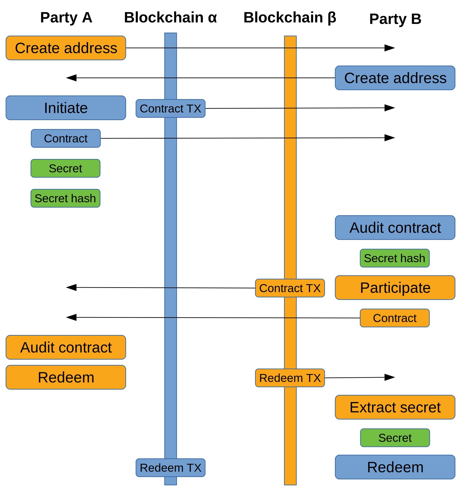

# Atomic swap (with Ethereum)

Atomic Swap is a trade between two users of different cryptocurrencies, wich does not require third party to be involved.
Cross-chain swaps require each party to pay into a contract transaction, one contract for each blockchain.
The contracts contain an output that is spendable by either party, but the rules required for redemption are different for each party involved.

Illustration for the steps each party performs and the transfer of data between each party.

Detailed algorithm description [Decred](https://github.com/decred/atomicswap)